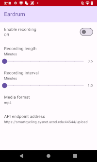

# Eardrum

Background audio recorder for Android

## Instructions

1. Accept permissions:
	* `Manifest.permission.RECORD_AUDIO` allows Eardrum to hear audio.
	* `Manifest.permission.WRITE_EXTERNAL_STORAGE` allows Eardrum to remember audio.
	* `android.permission.ACCESS_COARSE_LOCATION`, `android.permission.ACCESS_FINE_LOCATION`, and `android.permission.ACCESS_BACKGROUND_LOCATION` allow Eardrum to record location.

2. AudioRecorderService gets started by:
	* `MainActivity` every time you enable Eardrum.
	* `AlarmManager` every interval configurable on the settings page.

3. AudioRecorderService creates a new recording or stops a recording every time it's started:
	* Records audio in the background using your device's main microphone.
	* Writes audio to a file with pattern `yyyy-MM-dd'T'HH:mm:ss'Z.ext`.
	* Stores the files at `/storage/emulated/0/Android/data/com.miguelrochefort.eardrum/`.
	* Uploads the file with sensor data to configured server.

## Settings
There are five main settings that can be accessed on the app main page
1. Enable recording: Start or stop Eardrum
2. Recording length: Length of recording
3. Recording interval: Iterval between recordings
4. Media format: Which format to save audio in
5. API endpoint address: Address of server to upload to

## Screenshot

## Repository layout
This is a standard Android application repository. The app currently targets SDK 29 with a min of SDK 21 and a compile of SDK 31. All the app files are written in kotlin and the gradle scripts should be recently up to date as of the writing of this. The main app is composed of a few files

* `Constants.kt` holds the constants for other parts of the program
* `Status.kt` holds the status object for organizing data
* `UI.kt` holds the compose UI for the settings page
* `MainActivity.kt` holds the main thread of the application, which controls the settings page and starts and stops the recorder service
* `AudioRecorderService.kt` holds the audio recorder service, which manages all the recording of audio and other sensors and the uploading of data to the main server
  
## Notes
* Only briefly tested on a Nexus 4 running Android 5.1 and Android 10.
